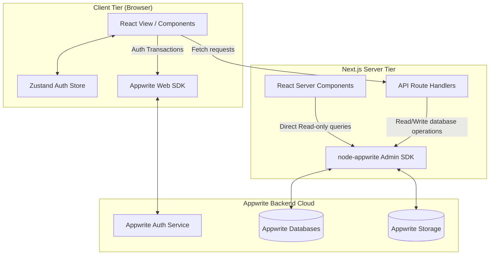

# RiverFlow 🌊

RiverFlow is a premium, developer-focused Q&A platform built for speed, clean aesthetics, and interactive learning. Modeled after legacy developer forums like StackOverflow, RiverFlow is reimagined with a modern dark theme, smooth micro-animations, real-time database reactivity, user reputation systems, and intuitive markdown editing.

---

## 🎯 Purpose

Modern developer forums often feel cluttered, slow, and visually outdated. **RiverFlow** bridges the gap by delivering a highly responsive, modern, and engaging community workspace.

Beyond being a developer-facing application, RiverFlow serves as an architectural pattern showcase for:

- Building **Next.js (App Router)** apps combined with **Appwrite** as a Backend-as-a-Service (BaaS).
- Demonstrating proper segregation of server-side Node SDK logic and client-side Web SDK capabilities.
- Achieving performance optimization through React Server Components (RSC) and dynamic client-side caching.
- Creating premium visual interfaces using custom shaders, canvas particle animations, and glassmorphism styling.

---

## 🛠️ Tech Stack & Badges

<p align="center">
  <a href="https://nextjs.org/">
    
  </a>
  <a href="https://react.dev/">
    
  </a>
  <a href="https://appwrite.io/">
    
  </a>
  <a href="https://tailwindcss.com/">
    
  </a>
  <a href="https://www.typescriptlang.org/">
    
  </a>
  <a href="https://zustand-demo.pmnd.rs/">
    
  </a>
</p>

### Technologies Used

| Technology                | Symbol | Role in Application                                                                                   |
| :------------------------ | :----: | :---------------------------------------------------------------------------------------------------- |
| **Next.js (v15+)**        |   🌐   | Server-side rendering (SSR), React Server Components (RSC), API routes, and Turbopack bundler.        |
| **Appwrite BaaS**         |   🔥   | Handles user authentication, database collections, storage bucket files, and user preference presets. |
| **Tailwind CSS**          |   🎨   | Core styling engine supplying HSL utility-first colors and modular design constraints.                |
| **TypeScript**            |   🛡️   | Complete static typing coverage protecting component boundaries and database document shapes.         |
| **Zustand**               |   📦   | Lightweight client-side store maintaining active session contexts and local auth user profiles.       |
| **Aceternity & Magic UI** |   ✨   | Canvas particles, shimmering components, background laser grids, and confetti animations.             |

---

## 📐 Detailed Architecture

RiverFlow is divided cleanly into local client scopes and secure server scopes to assure fast data load times without compromising security.



### Data Fetching & Sync Flow

1. **Read Request (RSC)**: When loading a page like `/questions/[quesId]`, Next.js invokes Appwrite's server-side Node SDK directly with full credentials, skipping client roundtrips. Data is cleaned (`JSON.parse(JSON.stringify)`) and streamed down directly as raw HTML/React elements.
2. **Interactive States**: Voting and comments are handled client-side by sending POST/DELETE requests to local Next.js Route Handlers (`/api/vote`, `/api/answer`).
3. **Reputation Updates**: When a new answer is created or deleted, Next.js API routes securely fetch the author's preferences from Appwrite's User administration API, adjust the reputation score, and persist it server-side.
4. **File Handling**: Questions can upload files directly via the client to the Appwrite Storage bucket. The detail page uses the server-side API key configuration to dynamically serve original raw resources using `getFileView()`.

---

## 🗄️ Database Schemas

RiverFlow utilizes four Appwrite collections managed under a single Database entity (`db`):

### 1. `Questions` Collection

- Stores user-created queries.
  | Attribute Name | Type | Key Details |
  | :--- | :--- | :--- |
  | `title` | String | Title of the question. |
  | `content` | String (Markdown) | Extended body text detailing the problem. |
  | `authorId` | String | Relates to the Appwrite User account ID. |
  | `tags` | String Array | Dynamic list of technology tag labels. |
  | `attachmentId` | String | Refers to the uploaded image in Appwrite Storage. |

### 2. `Answers` Collection

- Stores responses to questions.
  | Attribute Name | Type | Key Details |
  | :--- | :--- | :--- |
  | `content` | String (Markdown) | Body text of the answer. |
  | `questionId` | String | References the parent `Questions` document ID. |
  | `authorId` | String | References the Appwrite User account ID. |

### 3. `Comments` Collection

- Holds comments on either questions or answers.
  | Attribute Name | Type | Key Details |
  | :--- | :--- | :--- |
  | `content` | String | Plaintext comment message. |
  | `type` | Enum (`question`, `answer`) | Denotes comment parent type. |
  | `typeId` | String | References target document ID. |
  | `authorId` | String | References Appwrite User account ID. |

### 4. `Votes` Collection

- Prevents double-voting and aggregates scores.
  | Attribute Name | Type | Key Details |
  | :--- | :--- | :--- |
  | `type` | Enum (`question`, `answer`) | Denotes voted target type. |
  | `typeId` | String | References target document ID. |
  | `voteStatus` | Enum (`upvoted`, `downvoted`) | Up or down indicator. |
  | `votedById` | String | References voting user's ID. |

---

## 📝 Software Prerequisites

Before initializing RiverFlow, please make sure your local development workspace contains:

- **Node.js**: `v18.17.0` or higher (tested with active LTS versions).
- **Package Manager**: `npm` v9+ or equivalent (`yarn` / `pnpm`).
- **Appwrite Instance**: An active account on [Appwrite Cloud](https://cloud.appwrite.io) or a locally running self-hosted Appwrite setup.
- **Git**: Installed for cloning and source configuration.

---

## 🚀 Getting Started

### 1. Configuration Settings

Rename or create a `.env` file in the root directory:

```env
NEXT_PUBLIC_APPWRITE_ENDPOINT="https://cloud.appwrite.io/v1"
NEXT_PUBLIC_APPWRITE_PROJECT_ID="YOUR_PROJECT_ID"
APPWRITE_API_KEY="YOUR_SECRET_API_KEY_WITH_DB_AND_STORAGE_PERMISSIONS"
```

### 2. Startup Commands

Install libraries and run the live reloading bundler:

```bash
# Clone the repository
git clone https://github.com/your-username/riverflow.git

# Enter workspace
cd riverflow

# Install project libraries
npm install

# Start Local Developer Server
npm run dev
```

Visit [http://localhost:3000](http://localhost:3000) inside your web browser. Database structures and file storage buckets will configure automatically on startup.
